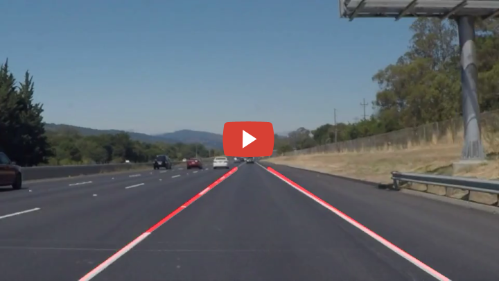
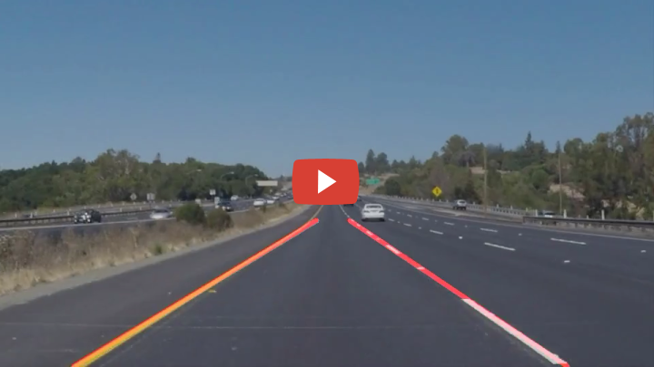
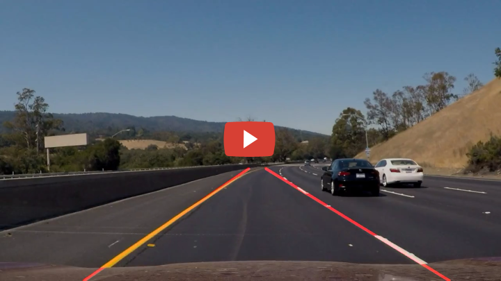

# Finding Lane Lines on the Road

When we drive, we use our eyes to decide where to go.  The lines on the road that show us where the lanes are act as our constant reference for where to steer the vehicle.  Naturally, one of the first things we would like to do in developing a self-driving car is to automatically detect lane lines using an algorithm.

The goal of this [project](https://github.com/udacity/CarND-LaneLines-P1) is to piece together a pipeline to detect the line segments in the image, then average/extrapolate them and draw them onto the image for display.

[//]: # (Image References)
[img1]: ./test_images/solidWhiteRight.jpg
[img2]: ./output_images/solidWhiteRight-canny.jpg
[img3]: ./output_images/solidWhiteRight-masked.jpg
[img4]: ./assets/line-segments-example.jpg
[img5]: ./output_images/solidWhiteRight.jpg

---
### Python Libraries 

Python 3 is needed along with the numpy, matplotlib, cv2, moviepy, and glob.

---
### Source Files 
The python source files are:

- `pipeline.py` - defines `process_image` function that combines pipeline functions that implements the methods described above.
- `run.py` - processes video or test images. See "Running" section below.

---
### Pipeline 

The tools used for lane line detection are color selection, region of interest selection, grayscaling, Gaussian smoothing, Canny Edge Detection and Hough Tranform line detection. These methods form the pipeline to process each image from video to detect lane lines. 

#### Step 1. Read in image

*Input image*
![][img1]


#### Step 2. Generate Canny image output from grayscale of image

*Canny image output*
![][img2]


#### Step 3. Define a Region of Interest and Mask out area outside of it

*Region of Interest masked*
![][img3]


#### Step 4. Use cv2.HoughLinesP() to derive line segment coordinates from step 2.

*Line segments highlighted*
![][img4]


#### Step 5. Calculate the left and right line coordinates from step 3 via averaging weighted slopes and y-intercepts, filtering out too short segments and filtering out slope and y-intercept outliers.


#### Step 6. Draw the two lane lines from step 4.

*Result lane lines image*
![][img5]


---

### Running

Commands
```sh
python run.py # produces images in output_images from test_images folder
python run.py video_in.mp4 video-out.mp4 # produces project and challenge video outputs
```

---

### Output

#### White Lanes Detection
[](https://youtu.be/8sLgPvoZTGs "White Lane Line Basic Detection (Udacity sdcnd P1)")

#### Yellow and White Lanes Detection
[](https://youtu.be/oQi79QNV2pQ "Yellow Lane Line Basic Detection (Udacity sdcnd P1)")

#### Challenge Video Output
[](https://youtu.be/mKxC1dtxVTo "Lane Lines Basic Detection Challenge Output (Udacity sdcnd P1)")


---

### Discussion

Currently, the pipeline is only shown to work for this particular camera and setup. It may not work on camera with different resolution; where the vertical center is higher or lower; and many other scenarios such as night time, bad weather conditions, etc.

Constants used for outliers detection in lane_lines(), min line length, and max line gap in hough_lines(), and elsewhere will probably need better methods for determination instead of trail and error.

Even though the algorithm detected the 2 video lanes fairly well, it produce quite a few bad lane detection frames for the challenge video. I tried to detect false lines better by saving the previous 3 frame's slope and intersect and use those instead for outliers detection. But turns out either it wasn't useful or more likely, mistake was made somewhere. Since we already know the colors of the lanes, color filtering can be used to enhance the detection as well to make it work better.

Enjoy the project, looking forward to next one.

##### [Project Review](UdacityReviews.pdf)
